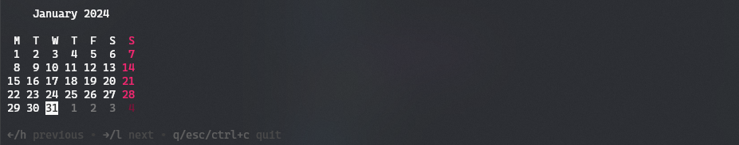
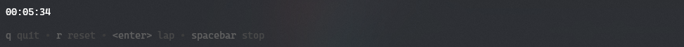
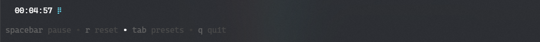

# It's `go-time`

A clock for the terminal.


## Commands

### `time`

Shows the current time

```sh
go-time
go-time now
go-time time
```


### `date`

Shows the current date

```sh
go-time date
```


### `cal`

Shows the calendar

```sh
go-time calendar
```



## TUI

### `clock`

Shows the clock

```sh
go-time clock
```


### `calendar`

Shows the calendar

```sh
go-time cal
```


## `stopwatch`

Shows the stopwatch

```sh
go-time stopwatch
```



## `timer`

Shows the timer

```sh
go-time timer
```



---

## License

This project is licensed under the [MIT License](LICENSE) - see the [LICENSE](LICENSE) file for details
